# Video2Knowledge

Transform educational videos into grounded, visual knowledge reports.

Video2Knowledge is an AI engineering project that turns a lecture or tutorial into a structured PDF. It combines speech, topic structure, and important on-screen material instead of treating the transcript as the whole source of truth.

## Why I built it

Educational videos communicate through two channels: narration and visuals. Diagrams, equations, tables, code, whiteboards, and UI demonstrations often carry information that speech-only summarizers miss. I built Video2Knowledge to explore how a multimodal pipeline can preserve both while keeping generated claims traceable to evidence.

## Core features

- Faster Whisper transcription with configurable model, device, compute type, and language
- TF-IDF-based lexical transcript segmentation
- High-recall candidate generation from scene changes and transcript visual cues
- Candidate fusion, near-duplicate removal, and visual-importance ranking
- Gemini visual understanding using local transcript context
- Temporal and semantic transcript–visual alignment
- Section-isolated grounded synthesis and a separate faithfulness-verification pass
- Numerical grounding checks for generated content
- PDF output using presentation frames re-extracted from the source video
- Per-run file checkpoints and structural evaluation

## Architecture and pipeline

```mermaid
flowchart LR
    A[Video] --> B[Ingestion]
    B --> C[Preprocessing]
    C --> D[ASR]
    D --> E[Segmentation]
    E --> F[Visual Candidate Generation]
    F --> G[Deduplication & Ranking]
    G --> H[VLM Visual Understanding]
    H --> I[Transcript-Visual Alignment]
    I --> J[Knowledge Synthesis]
    J --> K[Faithfulness Verification]
    K --> L[PDF Report]
    L --> M[Evaluation]
```



The code is organized by pipeline responsibility under `src/`: ingestion, preprocessing, transcription, segmentation, visual processing, alignment, synthesis, verification, reporting, and evaluation. `main.py` composes those modules into one CLI workflow.

## Engineering decisions

Candidate generation favors recall: scene-change detection finds visually new material, while transcript-guided extraction catches moments explicitly referring to a diagram, equation, table, screen, or related visual. Fusion combines overlapping evidence, perceptual comparison removes near-duplicates, and ranking limits costly VLM calls.

Each visual is analyzed with nearby transcript context, then aligned to a section using time and TF-IDF similarity. Synthesis receives one section's evidence at a time, which limits accidental leakage from unrelated parts of the video. Generated numerical claims must occur in trusted transcript or visible-text evidence.

Faithfulness verification is a distinct pass. It checks semantic relationships—including conjunctions, sequence, conditions, and causality—and corrects unsupported claims. This matters because a fluent summary can still reverse an `AND`/`OR` relationship or strengthen a claim beyond its evidence.

Analysis assets and presentation assets are deliberately separate. Candidate images are optimized for selection and understanding; PDF frames are extracted again at the chosen timestamps from the source video, preserving aspect ratio. A 2× Lanczos resize and mild unsharp mask improve presentation, but do not reconstruct missing detail.

## Installation

Requirements: Python 3.10+, FFmpeg/FFprobe on `PATH`, and a Gemini API key. A CUDA GPU is optional but useful for ASR.

```bash
python -m venv .venv
.venv\Scripts\activate
pip install -r requirements.txt
```

Create a local `.env` file (it is ignored by Git):

```dotenv
GEMINI_API_KEY=your_key_here
GEMINI_MODEL=your_available_gemini_model
```

## Usage

```bash
python main.py --input <video> --output <output-directory>
```

Example full run:

```bash
python main.py --input data/input/test.mp4 --output data/output/test --max-visuals 40
```

Bound a long video to its first 20 minutes:

```bash
python main.py --input data/input/test1.mp4 --output data/output/test1 --duration 1200 --max-visuals 40
```

Use `python main.py --help` for language, ASR, sampling, scene detection, candidate spacing, and time-range options. Existing valid stage outputs inside the supplied run directory are reused on restart.

## Output structure

```text
data/output/<run>/
├── audio/audio.wav
├── frames/sampled/
├── transcript/transcript.json
├── segmentation/sections.json
├── candidates_hybrid/{scene,transcript}/
├── visuals/{candidates,ranked_visuals,visual_analysis}.json
├── alignment/aligned_sections.json
└── report/
    ├── knowledge_report.json
    ├── verified_report.json
    ├── verification_audit.json
    ├── evaluation_report.json
    ├── report_frames/
    └── video2knowledge_report.pdf
```

Every run is isolated under its requested output directory, including verification checkpoints and report-frame caches.

## Evaluation

The evaluator checks artifact presence and structural consistency: section coverage, valid ranges, non-empty summaries and key points, aligned visual references, duplicate report visuals, and PDF creation. It reports real failures rather than manufacturing a pass. This is pipeline/structural QA, not a large benchmark of summary quality.

Run the automated tests with:

```bash
pytest -q
```

## Known limitations

- Visual extraction remains heuristic and may miss gradual or subtle changes.
- The lexical segmentation baseline uses TF-IDF rather than a learned topic model.
- PDF frame readability depends on source-video quality.
- Long videos can require substantial ASR, VLM/API runtime, and API usage cost.
- Evaluation currently focuses on pipeline and structural correctness.

## Future improvements

- Calibrate candidate ranking across different instructional formats
- Add richer evaluation datasets and human faithfulness review
- Improve retry/backoff and quota-aware execution around API stages
- Measure visual recall and section-boundary quality independently

## Tech stack

Python, Faster Whisper, FFmpeg, OpenCV, NumPy, scikit-learn, Google Gen AI SDK, Pydantic, Pillow, and ReportLab.

## License

MIT. See [LICENSE](LICENSE).
