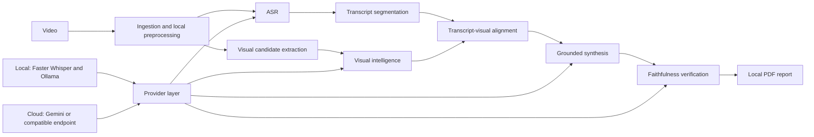

# Video2Knowledge

Turn educational videos into structured, visual knowledge reports.

Video2Knowledge is a modular multimodal application that converts a video into a grounded PDF: local media processing and speech recognition produce a transcript, hybrid visual extraction finds useful frames, configurable AI providers interpret and synthesize the evidence, a verification pass checks faithfulness, and ReportLab builds the final report.

## Why It Exists

Educational videos communicate through spoken explanation and through code, diagrams, charts, equations, slides, whiteboards, architecture drawings, and UI demonstrations. A transcript-only summary loses much of that second channel. Video2Knowledge aligns transcript and visual evidence so the report can preserve both.

## Features

- Local video validation, decoding, audio extraction, and frame sampling
- Public video URL ingestion through yt-dlp, including YouTube and other supported sites
- Local Faster Whisper transcription with CPU and CUDA options
- Hybrid scene-change and transcript-guided visual candidate extraction
- Near-duplicate removal and visual-importance ranking
- Knowledge analysis for code, diagrams, charts, equations, slides, whiteboards, and UI frames
- Temporal and semantic transcript-visual alignment
- Grounded report synthesis, numerical validation, and faithfulness verification
- Full-resolution source-frame PDF generation
- Run-local checkpoints, resume, and isolated outputs
- Simple Streamlit UI and backward-compatible CLI
- Smart, Private / Offline, Cloud, and Advanced execution profiles
- Independent Gemini, OpenAI-compatible, and local Ollama model backends
- Standard CPU Docker and optional NVIDIA GPU Compose configuration
- Offline unit tests and GitHub Actions CI

## Execution Modes

### Smart — Recommended

The default for normal users. It keeps ASR, video processing, frame extraction, and PDF generation local, then selects from models already configured. Cloud models are preferred when ready; otherwise Smart uses configured Ollama models. If neither setup is ready, it shows an actionable setup message.

### Private / Offline

Uses Faster Whisper plus configured Ollama vision and language models. No API key is required and video evidence stays on the machine during processing. Ollama and its models must be installed beforehand; the application never silently downloads multi-gigabyte models. A first model installation requires network access, after which processing can operate offline.

### Cloud

Uses configured hosted models for vision, synthesis, and verification. Gemini and generic OpenAI-compatible endpoints are supported; Gemini is not mandatory. Speech recognition remains local because a cloud ASR provider is not implemented.

### Advanced

Lets technical users choose a model independently for visual understanding, synthesis, and verification. Each model can use Gemini, Ollama, or a different OpenAI-compatible endpoint.

## Architecture



`src.application.service` is the UI-independent application boundary. It validates inputs, invokes the same pipeline used by the CLI, returns a structured result, and reports real stage progress through a callback. Provider protocols describe ASR, vision, synthesis, and verification capabilities; the factory validates each execution profile and creates only supported implementations.

Candidate images—not full videos—are sent to a cloud vision provider, together with nearby transcript context. Analysis assets remain separate from full-resolution source frames extracted locally for the PDF.

## Screenshots

Screenshot slots are reserved under `docs/assets/` for the home, processing, result, and advanced-mode views. No fabricated screenshots are included.

## Installation

### Local development

Requirements: Python 3.10+, FFmpeg/FFprobe on `PATH`, and optionally an NVIDIA CUDA environment.

```powershell
python -m venv .venv
.venv\Scripts\activate
pip install -r requirements.txt
copy .env.example .env
```

### Web UI

```powershell
streamlit run ui/streamlit_app.py
```

Open [http://localhost:8501](http://localhost:8501).

### Docker (CPU)

```bash
docker compose up --build
```

The standard image uses CPU Faster Whisper and supports Smart/Cloud mode with Gemini or an OpenAI-compatible endpoint, plus local processing when Ollama is reachable and models are installed.

### Docker with NVIDIA GPU

Install the NVIDIA driver, Docker Engine/Desktop GPU support, and NVIDIA Container Toolkit where required, then run:

```bash
docker compose -f docker-compose.yml -f docker-compose.gpu.yml up --build
```

The GPU file requests NVIDIA devices and switches Faster Whisper to CUDA. The CPU deployment does not depend on it.

## Configuration

Copy `.env.example` to `.env`; `.env` is ignored by Git. API calls always remain server-side.
For interactive runs, non-empty UI values take precedence over environment variables, which take precedence over built-in defaults. Keys entered in the UI remain in the current Streamlit session and are never written to project files.

| Variable | Purpose |
|---|---|
| `VIDEO2KNOWLEDGE_OUTPUT_DIR` | Base directory for isolated UI runs |
| `GEMINI_API_KEY` | Required for Gemini providers |
| `GEMINI_MODEL` | Shared Gemini fallback model |
| `GEMINI_VISION_MODEL` | Optional vision-specific Gemini model |
| `GEMINI_LLM_MODEL` | Optional synthesis-specific Gemini model |
| `GEMINI_VERIFICATION_MODEL` | Optional verification-specific Gemini model |
| `OPENAI_COMPATIBLE_BASE_URL` | Chat Completions API root, normally ending in `/v1` |
| `OPENAI_COMPATIBLE_API_KEY` | Optional endpoint credential; not required by local compatible servers |
| `OPENAI_COMPATIBLE_MODEL` | Shared compatible endpoint model ID |
| `OLLAMA_BASE_URL` | Ollama server URL |
| `OLLAMA_VISION_MODEL` | Installed local vision model |
| `OLLAMA_LANGUAGE_MODEL` | Installed local synthesis model |
| `LOCAL_ASR_MODEL` | Faster Whisper model name |
| `LOCAL_ASR_DEVICE` | `cpu` or `cuda` |
| `LOCAL_ASR_COMPUTE_TYPE` | Faster Whisper compute type |
| `LOCAL_VISION_MODEL` | Installed Ollama multimodal model |
| `LOCAL_LLM_MODEL` | Installed Ollama language model |
| `LOCAL_VERIFICATION_MODEL` | Optional separate Ollama verifier model |
| `HF_HOME` | Persistent Faster Whisper/Hugging Face cache |

## Local Models

Install [Ollama](https://ollama.com/) separately and explicitly select models appropriate for your hardware:

```bash
ollama pull <vision-model>
ollama pull <language-model>
```

Then set `LOCAL_VISION_MODEL` and `LOCAL_LLM_MODEL`. The vision model must support image input. Quantized models are generally more practical on consumer hardware, but exact memory needs depend on model and context size. CPU inference is supported where the selected model supports it and may be slow. CUDA out-of-memory or unavailable-server failures are converted into concise application errors with expandable diagnostics in the UI.

For Docker, point `OLLAMA_BASE_URL` at an Ollama service reachable from the container (for example `http://host.docker.internal:11434` with Docker Desktop). Ollama is intentionally not bundled into the standard image.

## CLI

Existing commands remain valid:

```bash
python main.py --input data/input/test.mp4 --output data/output/test --max-visuals 40
```

Process one public video URL through the same pipeline:

```bash
python main.py --url "VIDEO_URL" --output data/output/url-run
```

`--input` and `--url` are mutually exclusive. In the web UI, choose **Video URL**, paste a public URL, select **Load Video**, review its duration and source information, then generate the report. URL ingestion uses the yt-dlp Python API with playlist downloads disabled.

Select an execution profile when needed:

```bash
python main.py --input video.mp4 --output data/output/run --mode local --device cpu --compute-type int8
python main.py --input video.mp4 --output data/output/run --mode cloud
python main.py --input video.mp4 --output data/output/run --mode custom --vision-provider gemini --synthesis-provider ollama --verification-provider gemini --synthesis-model llama3.2
```

Use `python main.py --help` for all existing sampling, scene, ASR, time-range, and provider options.

## Output Structure

```text
data/output/<run-id>/
├── input/                         # Uploaded or downloaded source video
├── audio/audio.wav
├── frames/sampled/
├── transcript/transcript.json
├── segmentation/sections.json
├── candidates_hybrid/{scene,transcript}/
├── visuals/{candidates,ranked_visuals,visual_analysis}.json
├── alignment/aligned_sections.json
└── report/
    ├── knowledge_report.json
    ├── verified_report.json
    ├── verification_audit.json
    ├── evaluation_report.json
    ├── report_frames/
    └── video2knowledge_report.pdf
```

## Testing

```bash
pytest -q
python -m compileall -q src ui main.py
python main.py --help
```

Cloud APIs are mocked or bypassed in unit tests; CI does not require secrets. CI also creates deterministic test media, validates Compose files, and builds the standard CPU image.

## Project Structure

```text
src/application/       Service layer and structured results
src/providers/         Protocols, profile resolution, hardware detection, providers
src/ingestion/         Input validation and metadata
src/preprocessing/     Local audio and frame extraction
src/transcription/     Faster Whisper implementation
src/segmentation/      TF-IDF transcript segmentation
src/visuals/           Candidate extraction, ranking, and analysis
src/alignment/         Temporal/semantic alignment
src/synthesis/         Grounded Gemini synthesis implementation
src/verification/      Faithfulness and numeric checks
src/reporting/         Full-resolution PDF generation
src/evaluation/        Structural QA
ui/                    Streamlit interface
tests/                 Offline regression and architecture tests
```

## Technology Stack

Python, Streamlit, yt-dlp, Faster Whisper, FFmpeg, OpenCV, NumPy, scikit-learn, Google Gen AI SDK, Ollama HTTP API, Pydantic, Pillow, ReportLab, pytest, Docker, and GitHub Actions.

## Privacy

- **Private / Offline:** AI inference uses local Faster Whisper and Ollama. Models must already be installed for fully disconnected use.
- **Cloud:** selected frames and relevant transcript evidence are sent only to the configured hosted model backend; preprocessing and PDF generation remain local.
- **Smart:** chooses a ready configured cloud model or falls back to ready local Ollama models and reports the actual selection.

Uploaded files are sanitized and stored only inside unique run directories. Subprocesses use argument lists rather than interpolated shell commands. Credentials are never written into outputs or browser code.

## Limitations

- URL support depends on the sites and public formats supported by the installed yt-dlp version; authenticated or DRM-protected videos are not supported.
- Local model quality and JSON reliability depend on the selected Ollama models.
- Visual extraction is heuristic, and segmentation uses a TF-IDF baseline.
- PDF readability depends on source-video quality.
- Very long videos can require significant compute and provider usage.
- Evaluation focuses on pipeline structure and grounding checks rather than a large quality benchmark.

## Future Work

- More cloud and local providers, including cloud ASR
- Richer provider usage/cost metadata and automatic routing
- Visual-recall and human-faithfulness benchmarks
- Batch processing and optional authenticated-source integrations
- More configurable PDF layouts and a hosted service layer

## License

MIT. See [LICENSE](LICENSE).
